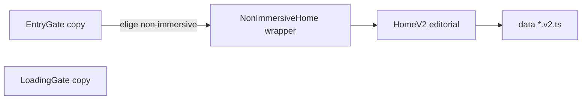

# Plan: modo clásico, componentes y datos

## Contexto técnico breve

- El **modo “estático” en UI** hoy vive sobre todo en [EntryGate.tsx](src/v2/components/EntryGate/EntryGate.tsx) (`staticLabel` / `staticSub`, handler `handleStaticMode`, clases CSS `introBtnStatic`*) y en un hint residual en [LoadingGate.tsx](src/v2/components/LoadingGate/LoadingGate.tsx) (“portfolio estático”).
- La **ruta de datos** del modo clásico es la misma que la home editorial: [HomeV2.tsx](src/v2/pages/HomeV2/HomeV2.tsx) consume [projects.v2.ts](src/v2/data/projects.v2.ts), [experience.v2.ts](src/v2/data/experience.v2.ts), [skills.v2.ts](src/v2/data/skills.v2.ts), [contact.v2.ts](src/v2/data/contact.v2.ts). El envoltorio [NonImmersiveHome.tsx](src/v2/components/NonImmersiveHome/NonImmersiveHome.tsx) solo añade el botón “Switch mode”.
- **No hace falta** renombrar el tipo `AppMode` ni la clave `v2:appMode`: siguen siendo `'immersive' | 'non-immersive'` ([appModeContext.tsx](src/v2/lib/appModeContext.tsx)); cambiar eso rompería persistencia y ramas en [HomeV2Shell.tsx](src/v2/pages/HomeV2/HomeV2Shell.tsx).

## 1. Renombre “estático” → “clásico”

| Ámbito                                   | Acción                                                                                                                                                                                                                                                                                                                                                                                                                                   |
| ---------------------------------------- | ---------------------------------------------------------------------------------------------------------------------------------------------------------------------------------------------------------------------------------------------------------------------------------------------------------------------------------------------------------------------------------------------------------------------------------------- |
| Copy ES                                  | “Modo Estático” → **“Modo clásico”**; subtítulo alineado con “layout editorial” (coherente con LoadingGate).                                                                                                                                                                                                                                                                                                                             |
| Copy EN                                  | “Static Mode” → **“Classic mode”** (o “Classic Mode” si prefieres capitalización de título).                                                                                                                                                                                                                                                                                                                                             |
| LoadingGate                              | Sustituir “entraras al portfolio estático” por texto con **modo clásico** / portfolio en vista clásica.                                                                                                                                                                                                                                                                                                                                  |
| Código / CSS (opcional pero recomendado) | Renombrar en EntryGate + [EntryGate.module.css](src/v2/components/EntryGate/EntryGate.module.css): `staticLabel` → `classicLabel`, `handleStaticMode` → `handleClassicMode`, clases `.introBtnStatic*` → `.introBtnClassic*`; en LoadingGate [LoadingGate.module.css](src/v2/components/LoadingGate/LoadingGate.module.css): `.modeBadgeStatic` → `.modeBadgeClassic`. Evita confusión futura con la palabra “static” en TypeScript/CSS. |

No tocar comentarios técnicos en otros archivos (p. ej. “static layer” en WebGL) salvo que sean copy visible.

## 2. Componentes externos: qué conviene que nos des

Orden práctico para implementar con buena fidelidad y menos ida y vuelta:

1. **Figma** (URL con `node-id`): encaja con el flujo de diseño→código y con los tokens/patrones del proyecto.
2. **Repositorio o CodeSandbox** con el componente en React: port directo con adaptación de estilos.
3. **Captura + prompt** (o solo prompt muy concreto): útil si no hay diseño formal; habrá más interpretación.

Los nuevos bloques deberían vivir como componentes bajo algo como `src/v2/components/...`, estilos en **CSS modules** como el resto de V2, y textos vía **patrón `isEs` / `locale`** como en HomeV2. Tras recibir el material, el trabajo será: extraer estructura, mapear colores/espaciado a [HomeV2.module.css](src/v2/pages/HomeV2/HomeV2.module.css) o módulo dedicado, y colocar cada pieza en el capítulo que corresponda (intro, about, work, etc.).

## 3. Enriquecer con más información (alcance acordado: ampliar datos existentes)

Sin nuevas secciones ni cambios en [TableOfContents](src/v2/components/TableOfContents/TableOfContents.tsx):

- **[experience.v2.ts](src/v2/data/experience.v2.ts)**: añadir entradas o alargar `description` / `technologies`; donde haga falta texto solo en ES, valorar campo opcional `descriptionEs` (requeriría un pequeño ajuste en el `map` de HomeV2 que hoy solo especializa `exp.id === '1'`).
- **[projects.v2.ts](src/v2/data/projects.v2.ts)**: enriquecer `description` / `descriptionEs`, `highlights` / `highlightsEs`, `tagline`, o `thumbnails` si aportan contexto.
- **[skills.v2.ts](src/v2/data/skills.v2.ts)**: más ítems o categorías si el modelo ya lo soporta.
- **[HomeV2.tsx](src/v2/pages/HomeV2/HomeV2.tsx)**: ajustar `heroLead`, `aboutPara1` / `aboutPara2` y cualquier otro string del objeto `ui` para alinear el tono con el nuevo contenido.

El texto concreto puede venir en un mensaje tuyo o en bullet points; se integrará bilingüe cuando aplique.

## Orden de implementación sugerido

1. Renombre copy + renombre interno (clases/handlers) en EntryGate y LoadingGate.
2. Recibir tus referencias de componentes e integrarlas en HomeV2 (o NonImmersiveHome si son globales al modo clásico).
3. Ampliar `*.v2.ts` y el objeto `ui` en HomeV2 con el contenido que aportes.

